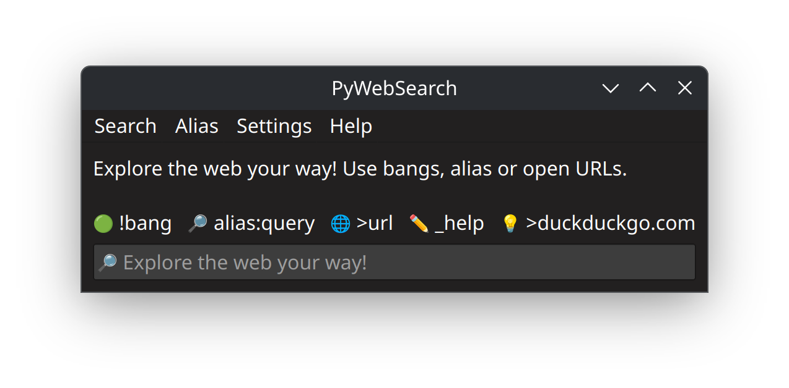

<div align="center">
  
</div>

# 📘 PyWebSearch — Customizable web search tool
[](https://www.gnu.org/licenses/gpl-3.0)

### **⚡ Perform fast searches and open web pages using customizable aliases and !bangs, with a user-friendly GUI.**

**PyWebSearch** is a custom, efficient web search tool with a focus on quick, flexible search queries and browsing.

It allows you to perform searches using configurable aliases, DuckDuckGo bangs, or direct URL opening, all integrated with a clean PyQt6 GUI interface. 

The application supports managing search aliases, search history, backups, and cross-platform browser integration.

This project aims to streamline web searching workflows by combining the power of search aliases with a user-friendly interface and platform-specific browser launching.

## ⚙️ Features

- 🔎 Search using customizable aliases (e.g., `g:query` for Google).
- 🧠 Support for DuckDuckGo bang commands (e.g., `!w query` for Wikipedia).
- 🌐 Direct URL opening with configurable prefix (`>` by default).
- ✏️ Alias management: create, edit, set defaults, and reset aliases.
- 🕘 Search history with viewing and clearing capabilities.
- 📤 Backup and restore of configuration and history files.
- 🧩 Cross-platform support with native browser detection and launching on Windows and Linux.
- 🎨 Interactive GUI built with PyQt6, including menu options for all features.
- 🚀 Supports custom browser commands with argument passing.
- 🈯 Internationalization support with gettext translations.
- 🖥️ **CLI Mode**: execute searches and open URLs directly from the terminal using aliases or prefixes.  
  Example:
  ```bash
  pywebsearch '>github.com'         # opens github.com in the browser
  pywebsearch 'g:script bash'       # searches Google using alias 'g'
  ```


## 🏗️ Built With

- [Python 3](https://www.python.org/)
- [PyQt6](https://riverbankcomputing.com/software/pyqt/)
- [platformdirs](https://pypi.org/project/platformdirs/)
- gettext for internationalization

## 🏁 Getting Started

### 📋 Prerequisites
- Python 3.7 or above
  
### 💾 Installation

1. Clone the repository:

   ```(bash
   git clone https://github.com/dmnmsc/pywebsearch.git
   cd pywebsearch
   ```

2. Install required packages:

   #### Debian / Ubuntu
   ```bash
   sudo apt update
   sudo apt install python3-pyqt6 python3-pip
   pip3 install -r requirements.txt
   ```

   #### Arch Linux / Manjaro
   ```bash
   sudo pacman -Syu
   sudo pacman -S python-platformdirs python-pyqt6
   yay -S python-pybrowsers   
   ```

   #### Windows
   ```bash
   pip install -r requirements.txt
   ```

> **Note:**  
> On Linux, it is recommended to install system packages like `python-pyqt6` before installing Python packages via pip.  
> For Arch Linux, `python-pybrowsers` might need to be installed from AUR using `yay` or another AUR helper.  
> On Windows, `pip install -r requirements.txt` installs all required Python dependencies.

---


## 🚀 Running the Application

Run the main script:

```bash
python main.py
```

You can pass search queries directly as command line arguments, e.g.:

```bash
python main.py '!g open source'
python main.py 'g:python programming'
python main.py '>github.com'
```

## 🕹️ Usage

- Use the input field to type search queries or special commands.
  
- Special commands start with an underscore `_` and let you manage aliases, history, settings, backups, etc.

-  You can use `>URL` to open a URL.
  
### Examples of commands:
  - `_alias` — show available aliases.
  - `_newalias` — create new alias.
  - `_edit` — edit alias file manually.
  - `_default` — set default alias.
  - `_resetalias` — reset default alias to DuckDuckGo.
  - `_history` — view search history.
  - `_clear` — clear search history.
  - `_backup` — create backup of configs and history.
  - `_restore` — restore from backup.
  - `_defaultbrowser` — set default browser command.
  - `_importbrowsers` — import extra browsers with pybrowsers or installed-browsers.
  - `_prefix` — change prefix symbol for opening URLs.
  - `_help` — show help information.
  - `_about` — show about information.
  - `_exit` — exit the application.


## 🔧 Default Aliases

When you start **PyWebSearch** for the first time, a configuration file is created with a selection of ready-to-use aliases for fast searching on popular services.  

Each alias is a short identifier you can type before your search query to direct it to the corresponding site.

| Alias | Service             | Description           | Example Usage                    |
|-------|---------------------|-----------------------|----------------------------------|
| g     | Google              | Classic Search        | `g:how hydrogen fuel cells work` |
| i     | Google Images       | Image Search          | `i:starry night`                 |
| y     | YouTube             | Videos                | `y:linux tutorial`               |
| w     | Wikipedia (EN)      | English Wikipedia     | `w:quantum theory`               |
| p     | Perplexity.ai       | AI-powered Search     | `p:artificial intelligence`      |
| d     | WordReference       | English Dictionary    | `d:resilience`                   |
| trans | Google Translate    | Automatic Translation | `trans:Hello world`              |
| gh    | GitHub              | Repositories Search   | `gh:pywebsearch`                 |
| gl    | GitLab              | Repositories Search   | `gl:pywebsearch`                 |
| so    | Stack Overflow      | Programming Q&A       | `so:python list comprehension`   |
| r     | Reddit              | Community Search      | `r:python question`              |
| .y    | YouTube (Incognito) | External browser flag | `.y:privacy videos`              |

> **ℹ️ You can check the full list of aliases with the special command `_alias` or by reviewing the configuration file.**

---

## ⚙️ Advanced Alias Customization

You can tailor **PyWebSearch** to your needs by adding, modifying, or deleting aliases **directly from the graphical interface**, no manual editing required.  

Each alias has three components: **name**, **description**, and **search URL** (where `$query` is replaced by your search).

### ➕ How to create or edit aliases?

1. **Use the special command:**  
   Type `_newalias` to create a new one, or `_edit` to modify an existing alias.

2. **Fill out the fields in the graphical dialog:**  
   - **Alias:** short word (e.g., `eco`)  
   - **Description:** site or service name (e.g., `Ecosia`)  
   - **URL:** search address using `$query` as placeholder  
     
     Example for Ecosia:  
     ```
     https://www.ecosia.org/search?q=$query
     ```

3. **Save and test the new alias:**  
   Type `eco:github` in the main window.

---

## ⌨️ Keyboard Shortcuts

  For faster access, consider assigning a global keyboard shortcut to launch **PyWebSearch**. This way you can open the search window instantly from anywhere, improving your workflow.

## 📂 Project Structure

- `main.py`: Entry point; initializes the GUI and main application logic.
- `app_settings.py`: Manages configuration, backups, alias management, and settings.
- `search.py`: Core search and URL processing logic.
- `alias.py`: Alias management (create, edit, set default aliases).
- `dialogs.py`: GUI dialogs for user interaction.
- `history.py`: Search history persistence and management.
- `backup.py`: Backup and restore of configuration and history files.
- `config.py`: Configuration file parsing and handling.
- `platform_base.py`: Abstract base class for platform-specific helpers.
- `windows.py`: Windows-specific functionality.
- `linux.py`: Linux-specific functionality.

## ✍️ Contributing

Contributions are welcome! Please fork the repository and create a pull request for any bug fixes or features.

## 📄 License

This project is licensed under the GNU General Public License v3.0 (GPL-3.0) - see the [LICENSE](LICENSE) file for details.

The GNU GPLv3 license ensures that any derivative works are also open source and that the freedoms to use, modify, and redistribute are preserved.  
It is a copyleft license that enforces source code disclosure when distributing modified versions.

For more information about the license, visit the [GNU GPLv3 official site](https://www.gnu.org/licenses/gpl-3.0.en.html).

